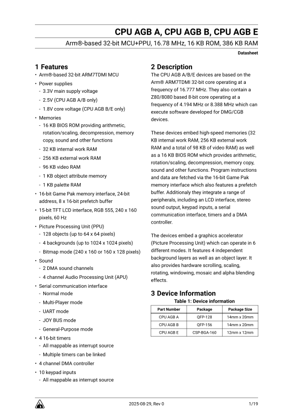

# Game Boy Advance CPU Datasheet
This is an unofficial datasheet for the Game Boy Advance CPUs (CPU AGB A/B/E) heavily inspired by STM32 datasheets.

- [Game Boy Advance CPU Datasheet](#game-boy-advance-cpu-datasheet)
  - [License](#license)
  - [Editing the datasheet](#editing-the-datasheet)
  - [Credits](#credits)

## License
This repository is licensed under Creative Commons Attribution-ShareAlike 4.0 International.

You can copy, share and modify the work for any purpose, even commercially, as long as appropriate credit is given to the original author and all derivative works are distributed under the same license. [Full license text](LICENSE)

## Editing the datasheet
To edit the datasheet, open the `AGB_CPU_Datasheet.typ` source file in a text editor. In order to generate a `.pdf` file you have to install the [Typst](https://github.com/typst/typst) compiler. The datasheet was created with Typst version 0.13.1. The `.svg` images in the `images` directory were created with [Inkscape](https://inkscape.org) version 1.4.2.

## Credits
 - Font: https://fonts.google.com/specimen/Roboto
 - Layout inspiration: https://www.st.com/resource/en/datasheet/stm32g431c8.pdf and https://www.st.com/resource/en/reference_manual/rm0440-stm32g4-series-advanced-armbased-32bit-mcus-stmicroelectronics.pdf
 - GBA technical info: https://problemkaputt.de/gbatek.htm
 - GBA documentation: https://gbadev.net/gbadoc
 - GBA schematic: https://www.retrosix.wiki/schematics-game-boy-advance
 - GBA SP schematic: https://github.com/Gekkio/gb-schematics/blob/main/AGS-CPU-11/schematic/AGS-CPU-11.pdf
 - Game Boy Micro schematic: https://github.com/HDR/Game_Boy_Micro_Schematic
 - Game Boy board scans: https://github.com/nataliethenerd/boardscans
 - GBA LCD specification: https://www.mouser.com/datasheet/2/365/LQ035Q7DH07N_SPEC_LD-21910A-184021.pdf
